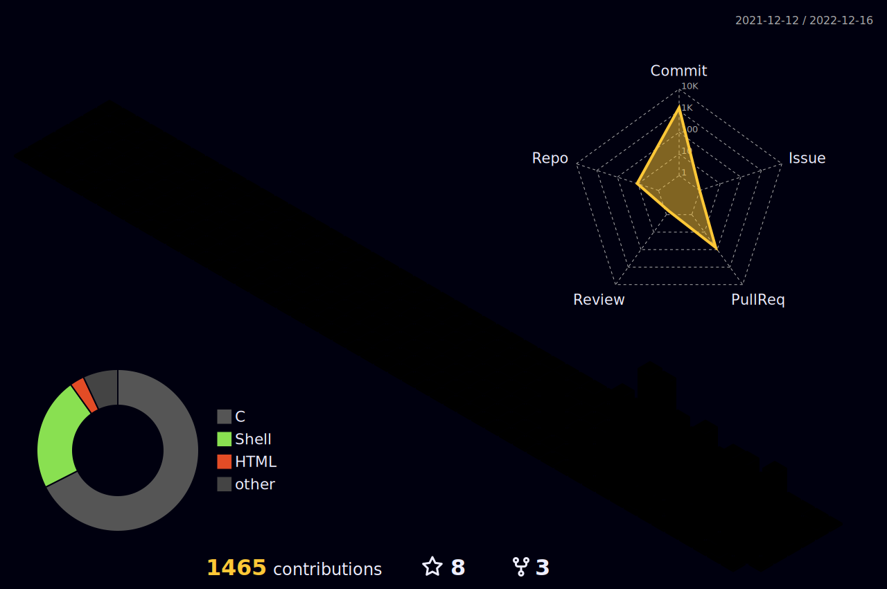

<!-- Banner Section -->

<!-- Contact Me Section -->
<h3 align="center">

</h3>

<!-- Snake Animation Section -->

<!-- Profile Counter Section -->
<h3 align="center">

</h3>

<!-- About Me Section -->
## ⛄ About Me
- 📚 Holberton Student on my third trimester
- ❄️ I'm currently learning `Java Script & Web 3.0'
- 📍 I'm currently located in Puerto Rico
- 📅 2023 Goals: Contribute to Open Source project
- 🎢 Fun Fact: I love to read books & listen to music

<!-- Languages Section -->
## :book: Languages

<!-- Frameworks, Libraries Sections -->
## :telescope: Frameworks, Platforms and Libraries

<!-- Databases Sections -->
## :bar_chart: Databases

<!-- IDEs Editors Sections -->
## :pencil: IDEs, Editors

<!-- Hosting Section -->
## :globe_with_meridians: Hosting

<!-- Operating Systems Section -->
## :computer: Operating Systems

<!-- Creative Section -->
## :milky_way: Creative Design

<!-- Virtual Machine Section -->
## :e-mail: Virtual Machine

<!-- Major Projects Sections -->
## 🏗️ Major projects worked on
| Project Name | Description                                                                                                                                 |
|--------------|---------------------------------------------------------------------------------------------------------------------------------------------|
|        | A replica from the printf function. Function that can take multiple data type and print their value.                                        |
|  | Designed and developed a shell with system calls, and zero memory leaks that could accept input from multiple commands and signal handling. |
|         | Interpreter for Monty Byte Codes files.                                                                                                     |

<!-- Blogs Sections -->
 ## :lock_with_ink_pen: Blogs
 
- [Python - Everything is an object](https://www.linkedin.com/pulse/python-everything-object-lizbeth-garcia/?trackingId=VAXcd53hRsWekfZyFrg1Fw%3D%3D)
- [How to list files with the extension "​.c" in the current directory](https://www.linkedin.com/pulse/how-list-files-extension-c-current-directory-lizbeth-garcia/?trackingId=mKwjGJx5QGSu2v8o3oH3sA%3D%3D)
- [How are integers stored in the memory using two components?](https://www.linkedin.com/pulse/how-integers-stored-memory-using-two-components-lizbeth-garcia/?trackingId=0heWUj5aQ3%2BVNZW7aZMlNg%3D%3D)

<!-- Github Stats Sections -->
## :bar_chart: GitHub Stats

<h3> 🔥 Streak Stats</h3>

----	

  

<h3> 📧 Top Language </h3>

----
  

<h3> 📊 Github Profile Stats </h3>

----
  
  

<h3> 🏆 Github Profile Trophy </h3>

----

<h3> 🌔 Contribution graph </h3>

----

  

<!-- Goodbye SVG Sections -->

